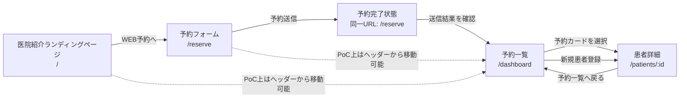

# 画面遷移図

この PoC では、URL を持つ画面をまず 4 つに限定します。

- 患者向け医院サイト: `/`
- 患者向け予約フォーム: `/reserve`
- 医院管理画面の予約一覧: `/dashboard`
- 医院管理画面の患者詳細: `/patients/:id`

予約完了、患者登録完了、記録追加完了は独立画面にせず、各画面内の完了状態として扱います。

## 画面一覧

| 区分 | 画面名 | URL | 主な役割 |
| --- | --- | --- | --- |
| 患者向け | 医院紹介ランディングページ | `/` | 医院紹介、診療案内、アクセス、予約導線 |
| 患者向け | 予約フォーム | `/reserve` | 来院予約の入力と送信 |
| 院内向け | 予約一覧 | `/dashboard` | 当日以降の予約確認、新規患者登録の入口 |
| 院内向け | 患者詳細 | `/patients/:id` | 基本情報、過去履歴、レントゲン情報、記録追加 |

## 遷移方針

- 患者向けの基本導線は `/ -> /reserve`
- 院内向けの基本導線は `/dashboard -> /patients/:id`
- 予約送信後は `/reserve` に留まり、完了メッセージを表示する
- 予約送信結果は `/dashboard` の予約一覧に反映される
- 新規患者登録後は `/dashboard` から `/patients/:id` に遷移する
- 患者詳細からは `/dashboard` に戻れる

## Mermaid

## 実装メモ

- まずは 4 URL を成立させ、各 URL ごとに主目的を 1 つに絞る
- 患者向けと院内向けの視覚トーンは後続工程で分ける
- ログイン、認証、権限分離は次段階で追加する
- 予約一覧と患者詳細の関係を軸にし、管理画面トップを別画面に増やさない
